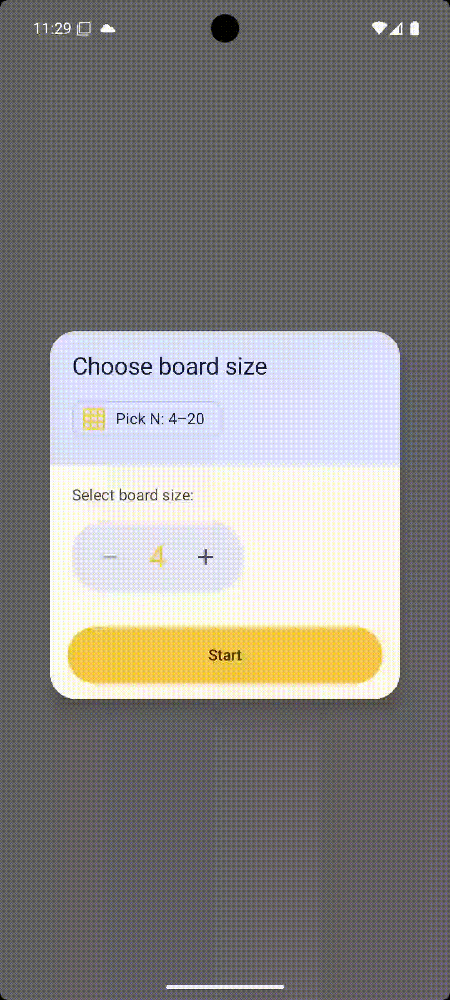

# ♛ N-Queens Android App — MVI Architecture

An elegant Android implementation of the classic **N-Queens puzzle**, built with modern Android architecture (MVI version), Jetpack Compose, and a strong focus on clean code, testability, and separation of concerns.

The app allows users to play, solve, and track their performance across different board sizes, featuring smooth animations, sound effects, and persistent leaderboards.

---

## 🎥 Demo

<p align="center">
  <a href="https://github.com/carlosjimz87/NQueens/releases/download/gifs/1.gif">
    
  </a>
  <a href="https://github.com/carlosjimz87/NQueens/releases/download/gifs/2.gif">
    
  </a>
  <a href="https://github.com/carlosjimz87/NQueens/releases/download/gifs/3.gif">
    
  </a>
</p>

---

## ✨ Features

- 🧩 Interactive N-Queens board (from 4×4 up to 20×20)
- 👑 Conflict detection and visual feedback
- 🎉 Win animation when the puzzle is solved
- ⏱️ Game timer and move counter
- 🏆 Persistent leaderboards per board size
- 🔊 Sound effects for actions and game states
- 🧪 Extensive unit test coverage
- 🧱 Clean, modular, and test-friendly architecture

---

## 🛠 Tech Stack

- **Kotlin**
- **Jetpack Compose**
- **MVI Architecture**
- **Kotlin Coroutines & Flow**
- **Koin** (Dependency Injection)
- **Jetpack DataStore (Preferences)**
- **kotlinx.serialization**
- **MediaPlayer** (sound effects)

---

## 🧠 Architecture Overview (MVI)

This architecture follows a **strict unidirectional data flow**:

UI → Intent → ViewModel → State → UI  
                                           ↘ Effect → UI

---

## 📦 Modules

### `app`
Android layer:
- Jetpack Compose UI
- `BoardViewModel` (MVI)
- Sound system
- Persistence & repositories
- Dependency Injection

### `rules`
Pure Kotlin domain module:
- `NQueensSolver`
- Conflict detection
- Domain models (`GameState`, `GameStatus`, `Conflicts`, etc.)

> This module has **no Android dependencies** and is fully unit-testable.

---

## 🧩 Core MVI Components

### BoardIntent

Represents **user intentions** and UI actions.

```kotlin
sealed interface BoardIntent {
    data class SetBoardSize(val size: Int) : BoardIntent
    data class ClickCell(val cell: Cell) : BoardIntent
    object ResetGame : BoardIntent
    object EnterWinAnimation : BoardIntent
    object WinAnimationFinished : BoardIntent
}
```

---

### BoardState

Single immutable source of truth for the UI.

Only **UI-relevant data** lives here. Domain state is embedded via `GameState`.

```kotlin
data class BoardState(
    val isLoading: Boolean = false,
    val boardSize: Int? = null,
    val gameState: GameState? = null,
    val elapsedMillis: Long = 0L,
    val latestRank: LatestRank? = null,
    val boardPhase: BoardPhase = BoardPhase.Normal,
    val error: BoardError? = null
) {
    val queens: Set<Cell> get() = gameState?.queens.orEmpty()
    val conflicts: Conflicts get() = gameState?.conflicts ?: Conflicts.Empty
}
```

---

### BoardEffect

One-shot effects that **must not be persisted in state**.

```kotlin
sealed interface BoardEffect {
    data class PlaySound(val sound: Sound) : BoardEffect
    data class ShowSnackbar(val message: String) : BoardEffect
}
```

Used for:
- Sound playback
- Snackbars
- Transient UI reactions

---

### BoardViewModel

The single orchestrator of the feature.

Responsibilities:
- Handle `BoardIntent`
- Update `BoardState`
- Emit `BoardEffect`
- Coordinate solver, timer, and persistence
- Control UI phases explicitly

Key characteristics:
- No UI logic
- Explicit side effects
- Fully unit-testable
- Deterministic state transitions

---

## 🎮 UI Phases

UI transitions are modeled explicitly using `BoardPhase`:

```kotlin
enum class BoardPhase {
    Normal,
    WinAnimating,
    WinFrozen
}
```

This avoids implicit UI conditions and keeps animations and dialogs predictable.

---

## 🧪 Testing Strategy

The architecture enables fast and reliable tests:

- Domain logic tested in isolation (`rules` module)
- ViewModel tested with fake solver, timer, and repositories
- Effects tested explicitly
- Coroutine behavior tested with test dispatchers
- No Robolectric required

Run all tests:

```bash
./gradlew test
```

---

## 📐 Design Principles

- Single source of truth
- Immutable state
- Explicit side effects
- Unidirectional data flow
- Domain logic isolated from UI
- UI as a pure function of state
- High testability with low ceremony

---

## 🚀 Why MVI here?

MVI fits this project because:

- The game behaves like a state machine
- UI transitions matter (win animation, frozen board)
- Side effects must be explicit
- Predictability is more valuable than flexibility
